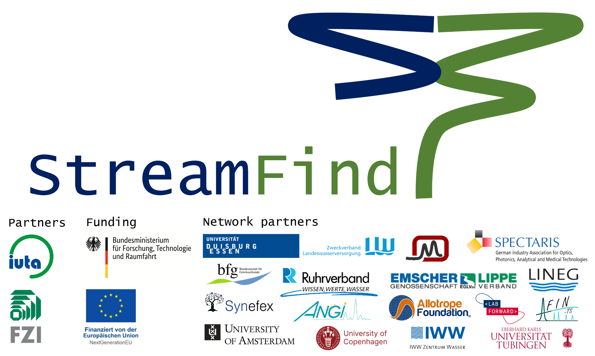

<!-- README.md is generated from README.Rmd. Please edit that file -->

```{r, include = FALSE}
knitr::opts_chunk$set(
  collapse = TRUE,
  comment = "#>",
  fig.path = "man/figures/README-",
  out.width = "100%"
)
```

<!-- badges: start -->
[](https://lifecycle.r-lib.org/articles/stages.html#experimental)
<!-- badges: end -->

```{r, echo=FALSE, out.width = '100%', fig.align='center', fig.alt="Logo"}

```

StreamFind R package is developed within the project ["Flexible data analysis and workflow designer to identify chemicals in the water cycle"](https://www.bildung-forschung.digital/digitalezukunft/de/bildung/digital-_und_datenkompetenzen/datenkompetenzen_wissenschaftlichen_nachwuchs/Projekte/stream_find.html) funded by the [German Federal Ministry of Education and Research (BMBF)](https://www.bmbf.de). The development is carried out by the [Institut für Umwelt & Energie, Technik & Analytik e. V. (IUTA)](https://www.iuta.de), the [Forschungszentrum Informatik (FZI)](https://www.fzi.de/) and supporting partners. StreamFind is intended to be a platform for assembling processing workflows for different types of data (e.g. mass spectrometry (MS) and spectroscopy data) with applications in different fields (e.g. environmental studies of the water cycle and quality control of pharmaceuticals). StreamFind aims to stimulate the use of advanced data analysis (e.g. non-target screening, statistical analysis, etc.) in routine studies, to promote standardization of data structure and processing, and to facilitate retrospective data evaluation. The StreamFind platform is aimed at scientists, but also at technicians due to its comprehensive documentation, its well categorized set of integrated modular processing methods and its embedded graphical user interface.

The StreamFind development is ongoing, please [contact us](mailto:cunha@iuta.de) for questions or collaboration.

## Installation

Pre-requisites for the StreamFind are the [R](https://cran.r-project.org/) software and the [RTools](https://cran.r-project.org/bin/windows/Rtools/) (only applicable for Windows users). RTools is needed for compiling C++ code used in the StreamFind R package. StreamFind also uses Python scripts for some of its processing methods, so it is recommended (but not mandatory) to have the latest [Python](https://www.python.org/downloads/) installed and added to the environmental variables for Windows users. Assuming that R, R Tools and Python (optional) are installed, the StreamFind R package can be installed from the GitHub repository via the [Bioconductor Manager](https://www.bioconductor.org/install/), which makes it easier to install necessary Bioconductor dependencies (e.g. zlibbioc and Rhdf5lib). Note that StreamFind itself is not available on Bioconductor. Please note that the default timeout for the `BiocManager::install` function might be to short. Thus, if the download of StreamFind fails run `options(timeout = 600)` before the installation command, as shown below.

```{r install-streamfind, eval=FALSE}
options(timeout = 600) # Increase timeout
if (!require("BiocManager", quietly = TRUE))
  install.packages("BiocManager")
BiocManager::install("odea-project/StreamFind")
```

## Other dependencies

Some processing methods used by StreamFind depend on other open-source software. For example, when conducting non-target screening using mass spectrometry, StreamFind utilises the [patRoon R package](https://github.com/rickhelmus/patRoon) and its associated dependencies for certain processing methods. If a dependency is not installed, a warning message with instructions will be displayed. Please consult the documentation for each processing method for details of its dependencies.

## Suplementary data

The supplementary [StreamFindData](https://github.com/odea-project/StreamFindData) R package holds the data used in examples and other documentation assets of the StreamFind and can also be installed from the GitHub repository.

```{r install-streamfinddata, eval=FALSE}
if (!require("BiocManager", quietly = TRUE))
  install.packages("BiocManager")
BiocManager::install("odea-project/StreamFindData")
```

## Docker Setup

The StreamFind can also be used via the [Docker](https://www.docker.com/products/docker-desktop/) container. The Docker container is a pre-configured environment with all the necessary dependencies installed.  The Docker container can be built and started with the following commands.

Build the Docker container:
`docker build -t my-r-app .`

Start the Docker container:

**For Linux/macOS/bash:**
```bash
docker run -it -p 3838:3838 -p 8787:8787 -v $(pwd):/app my-r-app
```

**For Windows PowerShell:**
```powershell
docker run -it -p 3838:3838 -p 8787:8787 -v "${PWD}:/app" my-r-app
```

Once the container is up, you'll be prompted to select the service you want to run:

- *Option 1:* Starts the Shiny application, accessible at http://localhost:3838.
- *Option 2:* Starts the RStudio Server, accessible at http://localhost:8787
  + Default Username is rstudio and Password is rstudio
- *Option 3:* Starts both the Shiny App and RStudio Server

## Documentation

The documentation and usage examples of the StreamFind R package can be found in the [reference page](https://odea-project.github.io/StreamFind/reference/index.html) and [articles](https://odea-project.github.io/StreamFind/articles/index.html) of the [webpage](https://odea-project.github.io/StreamFind/index.html), respectively. Note that documentation and articles are under development so not all are yet available.

## References

The StreamFind is open source due to public funding and the extensive contribution from scientific literature as well as existing open source software. Below, we reference the research and software that is used within StreamFind. Please note that each open source software or research that StreamFind uses relies on other contributions. Therefore, we recommend to search within each citation for other contributions.
<br>

---
nocite: '@*'
---
