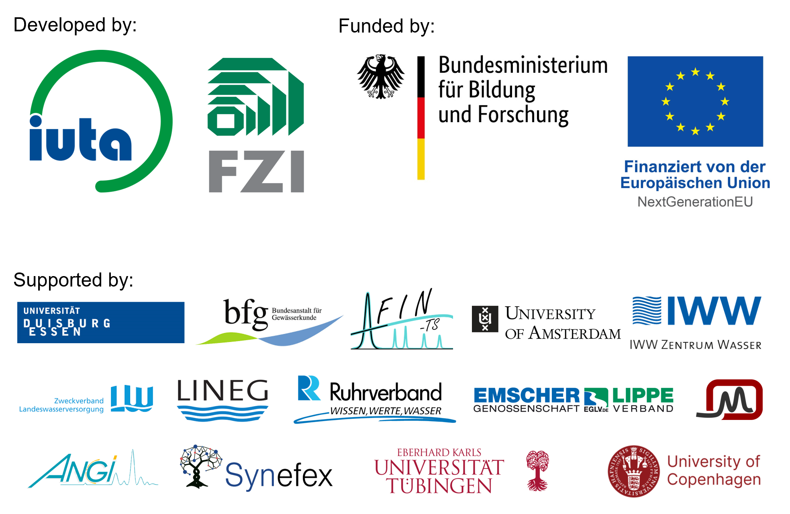

<!-- README.md is generated from README.Rmd. Please edit that file -->

# StreamFind

<!-- badges: start -->

[](https://lifecycle.r-lib.org/articles/stages.html#experimental)
<!-- badges: end -->

The StreamFind project, entitled “Flexible data analysis and workflow
designer to identify chemicals in the water cycle”, is funded by the
[Bundesministerium für Bildung und Forschung
(BMBF)](https://www.bmbf.de) and is a cooperation between the [Institut
für Umwelt & Energie, Technik & Analytik e. V.
(IUTA)](https://www.iuta.de), the [Forschungszentrum Informatik
(FZI)](https://www.fzi.de/) and supporting partners. The goal of the
StreamFind project is the development and assembly of data processing
workflows for mass spectrometry and spectroscopy and the application of
the workflows in environmental and quality studies of the water cycle.
The StreamFind aims to stimulate the use of advanced data analysis
(e.g., non-target screening, statistical analysis, etc.) in routine
studies, promoting standardization of data processing and structure and
easing the retrospective evaluation of data. The StreamFind platform is
directed to academics but also technicians, due to the aspired
comprehensive documentation, well categorized set of integrated modular
functions and the graphical user interface. The StreamFind development
is ongoing, please [contact us](mailto:cunha@iuta.de) for questions or
collaboration.



# StreamFind R package

The back-end framework of
[StreamFind](https://github.com/odea-project/StreamFind) is an R
package.

## Installation

For installation of the StreamFind R package, it is recommended to first
install the dependencies. Besides [R](https://cran.r-project.org/) and
[RTools](https://cran.r-project.org/bin/windows/Rtools/) (the latter is
only recommended for Windows users), the StreamFind depends on the
[patRoon](https://github.com/rickhelmus/patRoon) R package and its
dependencies. The patRoon R package combines several tools for basic and
advanced data processing and can be used interchangeably with the
StreamFind R package. Installation instructions for patRoon and its
dependencies can be found
[here](https://rickhelmus.github.io/patRoon/handbook_bd/manual-installation.html#r-prerequisites).

Then, the StreamFind R package can be installed from the GitHub
repository.

``` r
remotes::install_github("odea-project/StreamFind", dependencies = TRUE)
```

The supplementary
[StreamFindData](https://github.com/odea-project/StreamFindData) R
package holds the data used in examples and other documentation assets
of the StreamFind R package and can also be installed from the GitHub
repository.

``` r
remotes::install_github("odea-project/StreamFindData")
```

### Documentation

The documentation and usage examples of the StreamFind R package can be
found in the [reference
page](https://odea-project.github.io/StreamFind/reference/index.html)
and
[articles](https://odea-project.github.io/StreamFind/articles/index.html)
of the [webpage](https://odea-project.github.io/StreamFind/index.html).

# References

<div id="refs" class="references csl-bib-body hanging-indent">

<div id="ref-xcms03" class="csl-entry">

Benton, H. Paul, Elizabeth J. Want, and Timothy M. D. Ebbels. 2010.
“Correction of Mass Calibration Gaps in Liquid Chromatography-Mass
Spectrometry Metabolomics Data.” *BIOINFORMATICS* 26: 2488.

</div>

<div id="ref-proteo02" class="csl-entry">

Chambers, M. C., B. Maclean, R. Burke, D Amodei, D. L. Ruderman, S.
Neumann, L. Gatto, et al. 2012a. “A Cross-Platform Toolkit for Mass
Spectrometry and Proteomics.” *Nature Biotechnology* 30 (10): 918–20.
<https://doi.org/10.1038/nbt.2377>.

</div>

<div id="ref-mzr04" class="csl-entry">

Chambers, Matthew C., Maclean, Brendan, Burke, Robert, Amodei, et al.
2012b. “<span class="nocase">A cross-platform toolkit for mass
spectrometry and proteomics</span>.” *Nat Biotech* 30 (10): 918–20.
<https://doi.org/10.1038/nbt.2377>.

</div>

<div id="ref-msnbase02" class="csl-entry">

Gatto, Laurent, Sebastian Gibb, and Johannes Rainer. 2020. “MSnbase,
Efficient and Elegant r-Based Processing and Visualisation of Raw Mass
Spectrometry Data.” *bioRxiv*.

</div>

<div id="ref-msnbase01" class="csl-entry">

Gatto, Laurent, and Kathryn Lilley. 2012. “MSnbase - an r/Bioconductor
Package for Isobaric Tagged Mass Spectrometry Data Visualization,
Processing and Quantitation.” *Bioinformatics* 28: 288–89.

</div>

<div id="ref-patroon01" class="csl-entry">

Helmus, Rick, Thomas L. ter Laak, Annemarie P. van Wezel, Pim de Voogt,
and Emma L. Schymanski. 2021. “patRoon: Open Source Software Platform
for Environmental Mass Spectrometry Based Non-Target Screening.”
*Journal of Cheminformatics* 13 (1).
<https://doi.org/10.1186/s13321-020-00477-w>.

</div>

<div id="ref-patroon02" class="csl-entry">

Helmus, Rick, Bas van de Velde, Andrea M. Brunner, Thomas L. ter Laak,
Annemarie P. van Wezel, and Emma L. Schymanski. 2022. “patRoon 2.0:
Improved Non-Target Analysis Workflows Including Automated
Transformation Product Screening.” *Journal of Open Source Software* 7
(71): 4029. <https://doi.org/10.21105/joss.04029>.

</div>

<div id="ref-kpic01" class="csl-entry">

Ji, Hongchao, Fanjuan Zeng, Yamei Xu, Hongmei Lu, and Zhimin Zhang.
2017. “KPIC2: An Effective Framework for Mass Spectrometry-Based
Metabolomics Using Pure Ion Chromatograms.” *Anal Chem.* 14 (89):
7631–40. <https://doi.org/10.1021/acs.analchem.7b01547>.

</div>

<div id="ref-mzr02" class="csl-entry">

Keller, Andrew, Jimmy Eng, Ning Zhang, Xiao-jun Li, and Ruedi Aebersold.
2005. “A Uniform Proteomics MS/MS Analysis Platform Utilizing Open XML
File Formats.” *Mol Syst Biol*.

</div>

<div id="ref-proteo01" class="csl-entry">

Kessner, Darren, Matt Chambers, Robert Burke, David Agus, and Parag
Mallick. 2008. “ProteoWizard: Open Source Software for Rapid Proteomics
Tools Development.” *Bioinformatics* 24 (21): 2534–36.
<https://doi.org/10.1093/bioinformatics/btn323>.

</div>

<div id="ref-camera01" class="csl-entry">

Kuhl, C., R. Tautenhahn, C. Boettcher, T. R. Larson, and S. Neumann.
2012. “CAMERA: An Integrated Strategy for Compound Spectra Extraction
and Annotation of Liquid Chromatography/Mass Spectrometry Data Sets.”
*Analytical Chemistry* 84: 283–89.
<http://pubs.acs.org/doi/abs/10.1021/ac202450g>.

</div>

<div id="ref-mzr03" class="csl-entry">

Martens, Lennart, Matthew Chambers, Marc Sturm, Darren Kessner, Fredrik
Levander, Jim Shofstahl, Wilfred H Tang, et al. 2010. “MzML - a
Community Standard for Mass Spectrometry Data.” *Mol Cell Proteomics*.
<https://doi.org/10.1074/mcp.R110.000133>.

</div>

<div id="ref-mzr01" class="csl-entry">

Pedrioli, Patrick G A, Jimmy K Eng, Robert Hubley, Mathijs Vogelzang,
Eric W Deutsch, Brian Raught, Brian Pratt, et al. 2004. “A Common Open
Representation of Mass Spectrometry Data and Its Application to
Proteomics Research.” *Nat Biotechnol* 22 (11): 1459–66.
<https://doi.org/10.1038/nbt1031>.

</div>

<div id="ref-openms01" class="csl-entry">

Röst, Hannes L., Timo Sachsenberg, Stephan Aiche, Chris Bielow, Hendrik
Weisser, Fabian Aicheler, Sandro Andreotti, et al. 2016. “OpenMS: A
Flexible Open-Source Software Platform for Mass Spectrometry Data
Analysis.” *Nature Methods* 13 (9): 741–48.
<https://doi.org/10.1038/nmeth.3959>.

</div>

<div id="ref-xcms01" class="csl-entry">

Smith, C.A., Want, E.J., O’Maille, G., Abagyan,R., Siuzdak, and G. 2006.
“XCMS: Processing Mass Spectrometry Data for Metabolite Profiling Using
Nonlinear Peak Alignment, Matching and Identification.” *Analytical
Chemistry* 78: 779–87.

</div>

<div id="ref-xcms02" class="csl-entry">

Tautenhahn, Ralf, Christoph Boettcher, and Steffen Neumann. 2008.
“Highly Sensitive Feature Detection for High Resolution LC/MS.” *BMC
Bioinformatics* 9: 504.

</div>

</div>
