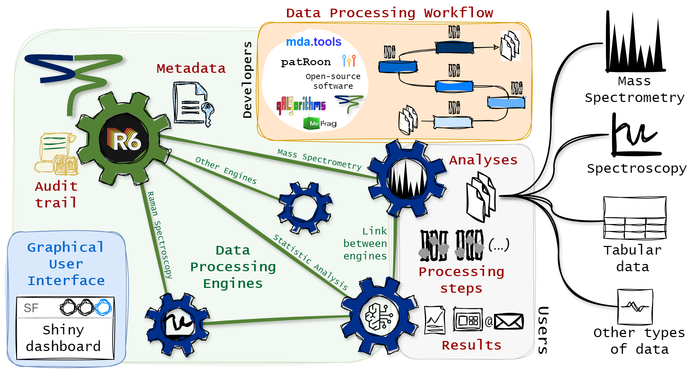

```{r setup, include=FALSE}
library(knitr)
library(kableExtra)
library(magrittr)
library(ggplot2)
library(plotly)
library(StreamFind)

knitr::opts_chunk$set(
  echo = TRUE,
  fig.align = "center",
  fig.width = 9,
  results = "markup",
  comment = "",
  message = FALSE,
  warning = FALSE
)

path_wd <- getwd()
```

```{r resources, include=FALSE}
all_files <- StreamFindData::get_ms_file_paths()
files <- all_files[grepl("blank|influent|o3sw", all_files)]

db <- StreamFindData::get_ms_tof_spiked_chemicals()
db <- db[grepl("S", db$tag), ]
cols <- c("name", "formula", "mass", "rt", "tag")
db <- db[, cols, with = FALSE]
```

```{=html}
<style>
pre {
  overflow-x: auto;
}
pre code {
  word-wrap: normal;
  white-space: pre;
}
</style>
```

<br>

<br>

------------------------------------------------------------------------

# Introduction

The StreamFind R package is a data agnostic data processing workflow designer. Besides data processing, the package can also be used for data management, visualization and reporting. This guide focuses on describing the general framework of StreamFind. StreamFind is centered around [R6](https://r6.r-lib.org/index.html) classes, serving as data processing engines (used as metaphor) for different types of data (e.g. mass spectrometry (MS) and Raman spectroscopy (RS) data).  

```{r concept-image, fig.cap="StreamFind Concept", out.width="100%", echo=FALSE, fig.align='center', fig.alt="Concept"}
#
```

Internally, the Engines (R6 classes) use six central [S7](https://github.com/RConsortium/S7) classes: `Metadata`, `Workflow`, `ProcessingStep`, `Analyses`, `Results` and `AuditTrail`. The `Metadata` class flexibly holds project information, such as name, author, date and file.  The `Workflow` class is an ordered list of `ProcessingStep` objects, which are used to harmonize the diversity of processing methods and algorithms available for a given data type. The `ProcessingStep` class is a representation of a processing method/step that transforms the data according to a specific algorithm. The `Analyses` class holds the data to be processed and the `Results` class holds the results of the data processing. The `AuditTrail` class records any modification to the project.

# `CoreEngine`

Data processing engines are fundamentally reference classes with methods to manage, process, visualize and report data within a project. The `CoreEngine` is the parent class of all other data specific engines (e.g. `MassSpecEngine` and `RamanEngine`). As parent,, the `CoreEngine` holds uniform functions across child data dedicated engines (e.g. managing the `Metadata`, recording the `AuditTrail` and applying a data processing `Workflow`).

```{r core-engine}
# Creates an empty CoreEngine
core <- CoreEngine$new()

# Prints the engine
core
```

Note that when an empty `CoreEngine` or any data specific engine is created, required entries of `Metadata` are created with default name, author, date and file. Yet, `Metadata` entries can be specified directly during creation of the `CoreEngine` via the argument `metadata` or added to the engine as shown in \@ref(metadata). The `CoreEngine` does not directly handle data processing. Processing methods are data specific and therefore, are used via the data dedicated engines. Yet, the framework to manage the data processing workflow is implemented in the `CoreEngine` and is therefore, harmonized across engines. Users will not directly use the `CoreEngine` but it is important to understand that it is in the background.

# `Metadata`

The `Metadata` S7 class is meant to hold project information, such as description, location, etc. The users can add any kind of entry to a named `list`. Below, a `list` of metadata is created and added to the `CoreEngine` for demonstration. Internally, the `list` is converted to a `Metadata` object. Modifying the entries in the `Metadata` is as modifying a `list` in R and the `Metadata` can be accessed by the active field `Metadata` in the `CoreEngine` of any other data specific engine.

```{r add-metadata}
# Creates a named list with project metadata
mtd <- list(
  name = "Project Example",
  author = "Person Name",
  description = "Example of project description"
)

# Adds/updates the Metadata in the CoreEngine
core$Metadata <- mtd

# Show mwthod for the Metadata class
show(core$Metadata)

# Adding a new entry to the Metadata
core$Metadata[["second_author"]] <- "Second Person Name"

show(core$Metadata)
```

# `Workflow`

A data processing workflow is represented in StreamFind by the class `Workflow`. A `Workflow` is composed of an ordered list of `ProcessingStep` objects. Each `ProcessingStep` object is a representation of a processing method/step that transforms the data according to a specific algorithm. The `ProcessingStep` class is used to harmonize the diversity of processing methods and algorithms available for a given data type.

```{r settings}
# Constructor for a processing step
ProcessingStep()
```

A `ProcessingStep` object must always have the data type, the processing method name, the name of the algorithm to be used, the origin software, the main developer name and contact as well as a link to further information and the DOI, when available. Lastly but not least, the parameters which is a flexible list of conditions to apply the algorithm during data processing.

The `ProcessingStep` is a generic parent class which delegates to child classes for specific data processing methods and algorithms. As example, the `ProcessingStep` child class for annotating features within a non-target screening workflow using a native algorithm from StreamFind is shown below. Each `ProcessingStep` child class has a dedicated constructor method with documentation to support the usage. Help pages for processing methods can be obtained with the native R function `?` or `help()`  (e.g., `help(MassSpecMethod_AnnotateFeatures_StreamFind)`).

```{r method-annotate-features}
# constructor of ProcessingStep child class
# for annotating features in a non-target screening workflow
# the constructor name gives away the engine, method and algorithm
# i.e.
# - the engine is MassSpecEngine
# - the method name is AnnotateFeatures
# - the algorithm name is StreamFind
MassSpecMethod_AnnotateFeatures_StreamFind()
```

# `Analyses`

As above mentioned, the `CoreEngine` does not handle data processing directly. The data processing is delegated to child engines. A simple example is given below by creating a child `RamanEngine` from a vector of paths to *asc* file with Raman spectra. The Raman spectra are used internally to initiate a `RamanAnalyses` (child class of `Analyses`), holding the raw data and any data processing results. Note that the `Workflow` and `Results` are still empty, as no data processing methods were applied.

```{r raman-engine}
# Example raman .asc files
raman_ex_files <- StreamFindData::get_raman_file_paths()

# Creates a RamanEngine with the example files
raman <- RamanEngine$new(analyses = raman_ex_files)

# Show the engine
raman
```

Data specific engines have dedicated active fields to access the data. For instance, the `Analyses` active field in the `RamanEngine` is used to access the raw data and results.

```{r raman-analyses}
# Gets the length of Analyses in the RamanEngine
length(raman$Analyses)

# Gets the names of the Analyses in the RamanEngine
names(raman$Analyses)

# Access the spectrum of the first analysis in the Analyses object
head(raman$Analyses$Spectra$spectra[[1]])
```

The methods for data access and visualization are also implemented as public methods in the data specific engine class. Although data can be obtained directly from the `Analyses` child classes, using the public methods in the engine is a preferable interface. Below, the `plot_spectra()` method is used to plot the raw Raman spectra.

```{r plot-spectra, fig.alt="Spectra Raw"}
# Plots the spectrum from analyses 1 and 12 in the RamanEngine
raman$plot_spectra(analyses = c(1, 12))
```

# Managing `Analyses`

Analyses can be added and removed from the engine with the `add_analyses()` and `remove_analyses()` methods, respectively. Below, the 1st and 12th analyses are removed from the engine and then added back.

```{r remove-raman-analyses}
raman$remove_analyses(c(1, 12))
length(raman$Analyses)
```

```{r add-raman-analyses}
raman$add_analyses(raman_ex_files[c(1, 12)])
length(raman$Analyses)
```

For data processing, the analysis replicate names and the correspondent blank analysis replicates can be assigned with dedicated methods, as shown below. For instance, the replicate names are used for averaging the spectra in correspondent analyses and the assigned blanks are used for background subtraction.

```{r replicate-blank-raman-analyses}
# Adds replicate names and blank names
raman$add_replicate_names(c(rep("Sample", 11), rep("Blank", 11)))
raman$add_blank_names(rep("Blank", 22))
```

```{r show-raman-egnine}
# the replicate names are modified
show(raman$Analyses)
```

```{r plot-spectra-replicates, fig.alt="Spectra Raw Replicates"}
# the spectra between shift values 700 and 800 are plotted
# the colorBy is set to replicates to legend by replicate names
raman$plot_spectra(shift = c(700, 800), colorBy = "replicates")
```

# Processing `Workflow`

As above mentioned, a `Workflow` is designed by an ordered list of `ProcessingStep` child class objects. Below a `list` of `ProcessingStep` child class objects for processing the Raman spectra is created and added to the active field `Workflow` of the `RamanEngine`.

```{r raman-workflow}
ps <- list(
  # averages the spectra for each analysis replicate
  RamanMethod_AverageSpectra_native(),

  # simple normalization based on maximum intensity
  RamanMethod_NormalizeSpectra_minmax(),

  # background subtraction
  RamanMethod_SubtractBlankSpectra_StreamFind(),

  # applies smoothing based on moving average
  RamanMethod_SmoothSpectra_movingaverage(windowSize = 4),

  # removes a section from the spectra from -40 to 300
  RamanMethod_DeleteSpectraSection_native(min = -40, max = 300),

  # removes a section from the spectra from 2000 to 3000
  RamanMethod_DeleteSpectraSection_native(min = 2000, max = 3000),

  # performs baseline correction
  RamanMethod_CorrectSpectraBaseline_baseline_als(lambda = 3, p = 0.06, maxit = 10)
)
```

```{r add-show-raman-workflow}
# The workflow is added to the engine but not yet applied
# The results are still empty
raman$Workflow <- ps

# Gets the names of the results in the Analyses object
# As data processing was yet applied, the results field in Analyses is empty
names(raman$Analyses$results)

# Shows the workflow
show(raman$Workflow)
```

```{r run-raman-workflow}
# The data processing workflow is applied
raman$run_workflow()

# Gets the names of the results in the Analyses object
# A RamanSpectra (Results child class) is now added with the processed spectra
names(raman$Analyses$results)
```

The method `run()` can be used to applied a single `ProcessingStep` object to the data. Note that the `ProcessingStep` step is always added to the bottom of the `Workflow` in the engine. Below, the normalization based on minimum and maximum is applied to the Raman spectra and then the `Workflow` is shown, including another normalization step in the last position.

```{r add-extra-settings}
# performs again normalization using minimum and maximum
raman$run(RamanMethod_NormalizeSpectra_minmax())
```

```{r print-workflow-2}
# the workflow is shown with another normalization step at the end
show(raman$Workflow)
```

# `Results`

Once the data processing methods are applied, the results can be accessed with the dedicated and engine specific active fields and methods, as shown below. The results are always added as S7 `Results` child classes in the results field of the `Analyses`. 

```{r raman-results}
# The spectra results were added
raman
```

```{r raman-septra}
# Results can be obtained with the dedicated active fields
# The Results active fields are engine specific
show(raman$Spectra)
```

```{r raman-plot-spectra-results, fig.alt="Spectra Processed"}
# Processed spectrum, note that the blank was subtracted
raman$plot_spectra()
```

# Saving and loading

The `CoreEngine` also holds the functionality to save the project in the engine (as an *.rds* or *.sqlite* file) and load it back. As shown below, the `save()` and `load()` methods are used for saving and loading the `RamanEngine`, respectively.

```{r save}
project_file_path <- file.path(getwd(), "raman_project.rds")
raman$save(project_file_path)
```

```{r confirm-save}
file.exists(project_file_path)
```

```{r load}
new_raman <- RamanEngine$new()
new_raman$load(project_file_path)
```

```{r show-metadata-new-raman}
# the Metadata are has the raman object although
# a new_raman object was created with default Metadata
show(new_raman$Metadata)
```

```{r show-results-new-raman}
# the results are also available in the new_raman object
show(new_raman$Spectra)
```

```{r remove-engine, include=FALSE}
file.remove(project_file_path)
```

# Conclusion

This quick guide introduced the general framework of StreamFind. The StreamFind is a data agnostic processing workflow designer that uses R6 classes to manage, process, visualize and report data within a project. The `CoreEngine` is the parent class of all other data specific engines and manages the project information via the class `Metadata`. The `ProcessingStep` are used to harmonize the diversity of processing methods and algorithms available in a `Workflow` object. The data processing is delegated to child engines, such as the `RamanEngine` and `MassSpecEngine`. The `Workflow` is assembled by combining different `ProcessingStep` child class objects in a specific order. The `Results` can be accessed with dedicated fields (e.g. `spectra` and `plot_spectra`). StreamFind can be used via scripting as demonstrated in this guide or via the embedded shiny app for a graphical user interface. See the [StreamFind App Guide](https://odea-project.github.io/StreamFind/articles/app_guide.html) for more information.

------------------------------------------------------------------------
