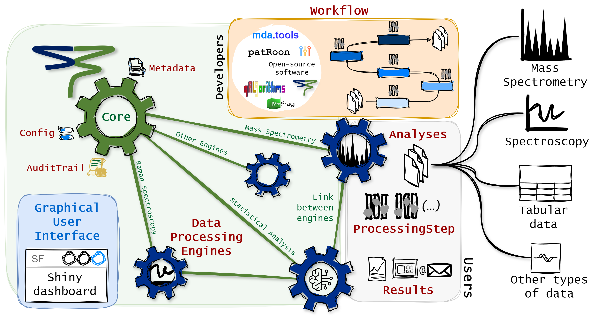

```{r setup, include=FALSE}
library(knitr)
library(kableExtra)
library(magrittr)
library(ggplot2)
library(plotly)
library(StreamFind)

knitr::opts_chunk$set(
  echo = TRUE,
  fig.align = "center",
  fig.width = 8.5,
  results = "markup",
  comment = "",
  message = FALSE,
  warning = FALSE
)

options(
  DT.options = list(
    dom = "lfrtip",
    autoWidth = TRUE,
    pageLength = 10,
    scrollX = TRUE,
    lengthMenu = c(10, 20, 50, 75, 100),
    initComplete = htmlwidgets::JS(
      "function(settings, json) {",
      "$(this.api().table().body()).css({'font-size': '12px'});",
      "$(this.api().table().body()).css({'white-space': 'nowrap'});",
      "}"
    )
  )
)

path_wd <- getwd()
```

```{r resources, include=FALSE}
all_files <- StreamFindData::get_ms_file_paths()
files <- all_files[grepl("blank|influent|o3sw", all_files)]
db <- StreamFindData::get_ms_tof_spiked_chemicals()
db <- db[grepl("S", db$tag), ]
cols <- c("name", "formula", "mass", "rt", "tag")
db <- db[, cols, with = FALSE]
```

<br>

<br>

------------------------------------------------------------------------

# Introduction

The StreamFind R package is a data agnostic data processing workflow designer. Besides data processing, the package can also be used for data management, visualization and reporting. This guide focuses on describing the general framework of StreamFind. StreamFind uses [R6](https://r6.r-lib.org/index.html) classes as main interface and for project management and [S3](https://adv-r.hadley.nz/s3.html) classes for internal data handling and organization.

```{r concept-image, fig.cap="StreamFind Concept", out.width="100%", echo=FALSE, fig.align='center', fig.alt="Concept"}

```

The R6 classes have a common parent named [`Engine`](https://odea-project.github.io/StreamFind/reference/Engine.html). The `Engine` is the parent class of all other data specific engines (e.g., [`MassSpecEngine`](https://odea-project.github.io/StreamFind/reference/MassSpecEngine.html) and [`RamanEngine`](https://odea-project.github.io/StreamFind/reference/RamanEngine.html)). The `Engine` holds uniform interface class objects and functions across child data dedicated engines, such as managing the `Metadata`, recording the `AuditTrail` and applying the `Workflow`.

Internally, the Engine R6 classes use seven central S3 classes:
 
 - [`Metadata`](https://odea-project.github.io/StreamFind/reference/Metadata.html)
 - [`Workflow`](https://odea-project.github.io/StreamFind/reference/Workflow.html)
 - [`ProcessingStep`](https://odea-project.github.io/StreamFind/reference/ProcessingStep.html)
 - [`Analyses`](https://odea-project.github.io/StreamFind/reference/Analyses.html)
 - [`Results`](https://odea-project.github.io/StreamFind/reference/Results.html)
 - [`AuditTrail`](https://odea-project.github.io/StreamFind/reference/AuditTrail.html)
 - [`Config`](https://odea-project.github.io/StreamFind/reference/Config.html)

The `Metadata` is fundamentally a named list with elements of length one, holding project information (e.g., name, author and date). The `Workflow` class is an ordered list of `ProcessingStep` objects, which are used to harmonize the diversity of processing methods and algorithms available for a given data type. The `ProcessingStep` class is a representation of a processing step (i.e., algorithm to be applied to the data). The `Analyses` class holds data or paths to raw data files. The `Results`, which is an element of the `Analyses` class, holds the results from data processing. The `AuditTrail` class records any modification to the project. The `Config` class holds configuration parameters for the engines, app, etc.

# `Engine`

Data processing engines are fundamentally used for project management. The [`Engine`](https://odea-project.github.io/StreamFind/reference/Engine.html) is the parent class of all other data specific engines (e.g. [`MassSpecEngine`](https://odea-project.github.io/StreamFind/reference/MassSpecEngine.html) and [`RamanEngine`](https://odea-project.github.io/StreamFind/reference/RamanEngine.html)). As parent, the `Engine` holds uniform functions across child data dedicated engines (e.g. managing the `Metadata`, recording the `AuditTrail` and applying the `Workflow`).

```{r engine}
# Creates an empty Engine.
engine <- Engine$new()

# Prints the engine.
engine
```

Note that when an empty `Engine` or any data specific engine is created, required entries of `Metadata` are created with default name, author, date and file. Yet, `Metadata` entries can be specified directly during creation of the `Engine` via the argument `metadata` or added to the engine as shown in \@ref(metadata). The `Engine` does not directly handle data processing. Processing methods are data specific and therefore, are used via the data dedicated engines (i.e., `MassSpecEngine` or `RamanEngine`). Yet, the framework to manage the data processing workflow is implemented in the `Engine` and is therefore, harmonized across engines. Users will not directly use the `Engine` but it is important to understand the background.

# `Metadata`

The [`Metadata`](https://odea-project.github.io/StreamFind/reference/Metadata.html) S3 class is meant to hold project information, such as description, location, etc. The users can add any kind of entry to a named `list`. Below, a `list` of metadata is created and added to the `Engine` for demonstration. Internally, the `list` is converted to a `Metadata` object. Modifying the entries in the `Metadata` is as modifying a `list` in R and the `Metadata` can be accessed by the active field `Metadata` in the `Engine` or any other data specific engine.

```{r add-metadata}
# Creates a named list with project metadata.
mtd <- list(
  name = "Project Example",
  author = "Person Name",
  description = "Example of project description"
)

# Adds/updates the Metadata in the CoreEngine.
engine$Metadata <- mtd

# Show mwthod for the Metadata class.
show(engine$Metadata)

# Adding a new entry to the Metadata.
engine$Metadata[["second_author"]] <- "Second Person Name"

show(engine$Metadata)
```

# `Workflow`

A data processing workflow is represented in StreamFind by the class [`Workflow`](https://odea-project.github.io/StreamFind/reference/Workflow.html). A `Workflow` is an ordered list of `ProcessingStep` objects. Each `ProcessingStep` object is a representation of a processing step that transforms the data according to a specific algorithm. The `ProcessingStep` class is used to harmonize the diversity of processing methods and algorithms available for a given data type.

```{r settings}
# Constructor for a processing step.
ProcessingStep()
```

A [`ProcessingStep`](https://odea-project.github.io/StreamFind/reference/ProcessingStep.html) object must always have the data type, the processing method name, required preceding processing methods, the name of the algorithm to be used, the class of input and output `Results` objects, the origin software, the main developer name and contact as well as a link to further information and the DOI, when available. Lastly but not least, the parameters, which is a flexible list of conditions to apply the algorithm.

The [`ProcessingStep`](https://odea-project.github.io/StreamFind/reference/ProcessingStep.html) is a generic parent class which delegates to child classes for specific data processing methods and algorithms. As example, the `ProcessingStep` child class for annotating features within a non-target screening workflow using a native algorithm from StreamFind is shown below. Each `ProcessingStep` child class has a dedicated constructor method with documentation to support the usage. Help pages for processing methods can be obtained with the native R function `?` or `help()`  (e.g., `help(MassSpecMethod_AnnotateFeatures_StreamFind)`).

```{r method-annotate-features}
# Constructor of ProcessingStep child class for annotating features in a non-target screening workflow the constructor name gives away the engine, method and algorithm.
MassSpecMethod_AnnotateFeatures_StreamFind()
```

# `Analyses`

As above mentioned, the `Engine` does not handle data processing directly. The data processing is delegated to child engines. A simple example is given below by creating a child `RamanEngine` from a vector of paths to *asc* files with Raman spectra. The Raman spectra are used internally to initiate a [`RamanAnalyses`](https://odea-project.github.io/StreamFind/reference/RamanAnalyses.html) (child class of [`Analyses`](https://odea-project.github.io/StreamFind/reference/Analyses.html)), holding the raw data and any data processing `Results` objects.

```{r raman-engine}
# Example raman .asc files.
raman_ex_files <- StreamFindData::get_raman_file_paths()

# Creates a RamanEngine with the example files.
raman <- RamanEngine$new(analyses = raman_ex_files)

# Show the engine class hierarchy.
class(raman)
```

Engine classes have dedicated active fields to access the major S3 classes (i.e., `Metadata`, `Analyses`, `Workflow`, `Results`, `AuditTrail` and `Config`). For instance, the `Analyses` active field in the `RamanEngine` is used to access the `RamanAnalyses` child class dedicated to RS. Other data dedicated fields are also implement for data specicic engines. Consult the documentation of the engines for more information (e.g., [`?RamanEngine`](https://odea-project.github.io/StreamFind/reference/RamanEngine.html)).

```{r raman-analyses}
# Gets the classes of the Analyses in the RamanEngine.
class(raman$Analyses)

# S3 methods are available for each Analyses child class.
get_analysis_names(raman$Analyses)[1:3]

# Access the spectrum of the first analysis in the Analyses object.
head(raman$Analyses$analyses[[1]]$spectra)
```

The methods for data access and visualization are also implemented as public S3 methods. Below, the `plot_spectra()` method from the `RamanAnalyses` class is used to plot the raw spectra from analyses 1 and 12. The available methods for each class is described in the documentation (e.g., [`?RamanAnalyses`](https://odea-project.github.io/StreamFind/reference/RamanAnalyses.html)).

```{r plot-spectra, fig.alt="Spectra Raw"}
# Plots the spectrum from analyses 1 and 12 in the RamanEngine.
plot_spectra(raman$Analyses, analyses = c(1, 12))
```

# Managing `Analyses`

Analyses can be added and removed with the `add()` and `remove()` S3 methods, respectively. Below, the 1st and 12th analyses are removed from the engine and then added back.

```{r remove-raman-analyses}
raman$Analyses <- remove(raman$Analyses, c(1, 12))
length(raman$Analyses$analyses)
```

```{r add-raman-analyses}
raman$Analyses <- add(raman$Analyses, raman_ex_files[c(1, 12)])
length(raman$Analyses$analyses)
```

For data processing, the analysis replicate names and the correspondent blank analysis replicates can be assigned with dedicated methods, as shown below. For instance, the replicate names are used for averaging the spectra in correspondent analyses and the assigned blanks are used for background subtraction.

```{r replicate-blank-raman-analyses}
# Sets replicate names and blank names.
raman$Analyses <- set_replicate_names(
  raman$Analyses,
  c(rep("Sample", 11), rep("Blank", 11))
)

raman$Analyses <- set_blank_names(
  raman$Analyses,
  rep("Blank", 22)
)
```

```{r show-raman-egnine}
# The replicate names are modified.
info(raman$Analyses)[, c(1:3)]
```

```{r plot-spectra-replicates, fig.alt="Spectra Raw Replicates"}
# The spectra between shift values 700 and 800 are plotted.
# The colorBy is set to replicates to legend by replicate names.
plot_spectra(raman$Analyses, shift = c(700, 800), colorBy = "replicates")
```

# Processing `Workflow`

The `Workflow` class is an ordered list of `ProcessingStep` child class objects. Below a `list` of `ProcessingStep` child class objects for processing the Raman spectra is created and added to the active field `Workflow` of the `RamanEngine`.

```{r raman-workflow}
ps <- list(
  # Averages the spectra for each analysis replicate.
  RamanMethod_AverageSpectra_native(),

  # Simple normalization based on maximum intensity.
  RamanMethod_NormalizeSpectra_minmax(),

  # Background subtraction.
  RamanMethod_SubtractBlankSpectra_StreamFind(),

  # Applies smoothing based on moving average.
  RamanMethod_SmoothSpectra_movingaverage(windowSize = 4),

  # Removes a section from the spectra from -40 to 300.
  RamanMethod_DeleteSpectraSection_native(min = -40, max = 300),

  # Removes a section from the spectra from 2000 to 3000.
  RamanMethod_DeleteSpectraSection_native(min = 2000, max = 3000),

  # Performs baseline correction.
  RamanMethod_CorrectSpectraBaseline_baseline_als(
    lambda = 3,
    p = 0.06,
    maxit = 10
  )
)
```

```{r add-show-raman-workflow}
# The workflow is added to the engine but not yet applied.
raman$Workflow <- ps

# Gets the names of the results in the Analyses object.
# As data processing was yet applied, the results field in Analyses is empty.
names(raman$Results)

# Shows the workflow.
show(raman$Workflow)
```

```{r run-raman-workflow}
# The data processing workflow is applied.
raman$run_workflow()

# Gets the names of the results in the Analyses object.
# A RamanResults_Spectra (Results child class) is now added with the processed spectra.
names(raman$Results)
```

The method `run()` can be used to applied a single `ProcessingStep` object to the data. Note that the `ProcessingStep` step is always added to the bottom of the `Workflow` in the engine. Below, the normalization based on minimum and maximum is applied to the Raman spectra and then the `Workflow` is shown, including another normalization step in the last position.

```{r add-extra-settings}
# Performs again normalization using minimum and maximum.
raman$run(RamanMethod_NormalizeSpectra_minmax())
```

```{r print-workflow-2}
# The workflow is shown with another normalization step at the end.
show(raman$Workflow)
```

# `Results`

Once the data processing methods are applied, the results can be accessed via the active field `Results` of the engine, which is the same as the results list of the `Analyses` class. Child classes of `Results` are used to hold the results from data processing. For istance, the `RamanResults_Spectra` is a child class of `Results` that holds the processed Raman spectra. Dedicated S3 methods are applied for each child class of `Results` to access and plot the processd data. The documentation of the `RamanResults_Spectra` class can be accessed with [`?RamanResults_Spectra`](https://odea-project.github.io/StreamFind/reference/RamanResults_Spectra.html) and describe the available methods and their usage. The `Results` child classes are workflow dependent and therefore, the results will change according to the `Workflow` applied. For instance, for mass spectrometry data, the [`MassSpecResults_Spectra`](https://odea-project.github.io/StreamFind/reference/MassSpecResults_Spectra.html) child class is used to hold processed spectra while the class [`MassSpecResults_NonTargetAnalysis`](https://odea-project.github.io/StreamFind/reference/MassSpecResults_NonTargetAnalysis.html) is used to hold the results from non-target screening analysis. The `Results` child classes are initiated with specific data processing methods and algorithms. For instance, the `ProcessingStep` child class [`MassSpecMethod_FindFeatures_openms`](https://odea-project.github.io/StreamFind/reference/MassSpecMethod_FindFeatures_openms.html) is used to initiate the [`MassSpecResults_NonTargetAnalysis`](https://odea-project.github.io/StreamFind/reference/MassSpecResults_NonTargetAnalysis.html) object and add it to the results list in the `MassSpecAnalyses`. See the [articles](https://odea-project.github.io/StreamFind/articles/index.html) for examples of workflows.

```{r raman-results}
# The spectra results were added.
names(raman$Results)

# The results can also be accessed via the Analyses class.
names(raman$Analyses$results)
```

```{r raman-septra}
show(raman$Results$RamanResults_Spectra)
```

```{r raman-plot-spectra-results, fig.alt="Spectra Processed"}
# Processed spectrum, note that the blank was subtracted.
plot_spectra(raman$Analyses)
```

# Saving and loading

The `Engine` also holds the functionality to save the project in the engine (as an *.rds* or *.sqlite* file) and load it back. As shown below, the `save()` and `load()` methods are used for saving and loading the `RamanEngine`, respectively.

```{r save}
project_file_path <- file.path(getwd(), "raman_project.rds")
raman$save(project_file_path)
```

```{r confirm-save}
file.exists(project_file_path)
```

```{r load}
new_raman <- RamanEngine$new()
new_raman$load(project_file_path)
```

```{r show-metadata-new-raman}
# The Metadata are has the raman object although a new_raman object was created with default Metadata.
show(new_raman$Metadata)
```

```{r show-results-new-raman}
# The results are also available in the new_raman object.
show(new_raman$Results$RamanResults_Spectra)
```

```{r remove-engine, include=FALSE}
file.remove(project_file_path)
```

# Conclusion

This quick guide introduced the general framework of StreamFind. The StreamFind is a data agnostic processing workflow designer that uses R6 classes for project management. The `Engine` is the parent class of all other data specific engines and manages the project information via the class `Metadata`. The `ProcessingStep` is used to harmonize the diversity of processing methods and algorithms available in a `Workflow` object. The data processing is delegated to child engines, such as the `RamanEngine` and `MassSpecEngine`. The `Workflow` is assembled by combining different `ProcessingStep` child class objects in a specific order. StreamFind can be used via scripting as demonstrated in this guide or via the embedded shiny app for a graphical user interface. See the [StreamFind App Guide](https://odea-project.github.io/StreamFind/articles/app_guide.html) for more information.

------------------------------------------------------------------------
